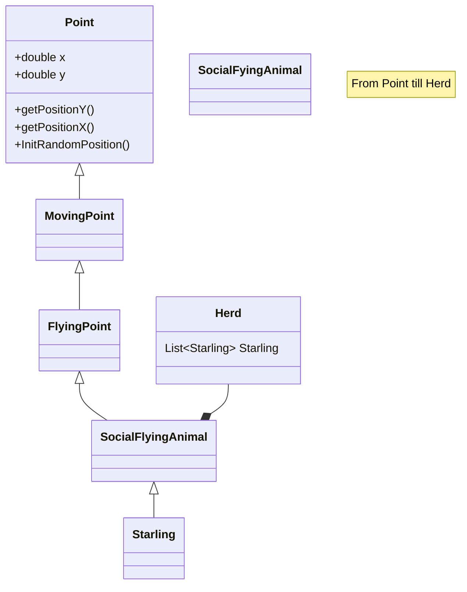

# The flight of the starlings

## Github

flight_of_the_starling

## Diagrama de Clases

```mermaid
classDiagram
    note "From Point till Herd"
    Point <|-- MovingPoint
    MovingPoint <|-- FlyingPoint
    FlyingPoint <|-- SocialFlyingAnimal
    SocialFlyingAnimal <|-- Starling
    Herd--*SocialFlyingAnimal
    class Point{
        +double x
        +double y
        +getPositionY()
        +getPositionX()
        +InitRandomPosition()
    }
    class MovingPoint{
        
    }
    class FlyingPoint{

    }
    class SocialFyingAnimal {

    }
    class Starling {

    }
    class Herd{
        List~Starling~  Starling
    }


```
